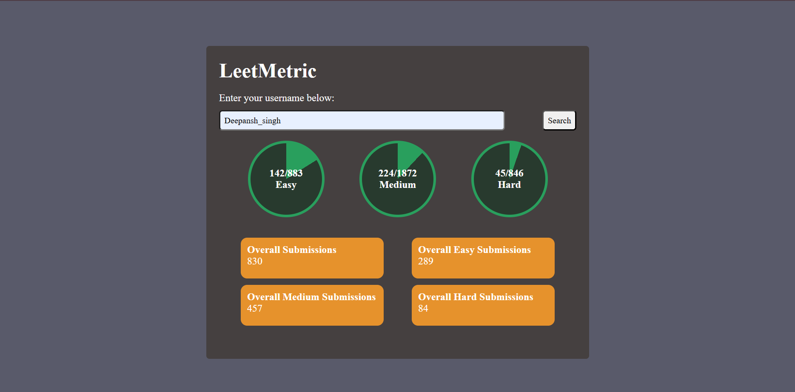

# LeetMetric

LeetMetric is a lightweight web app that lets you check a LeetCode user's problem-solving stats—broken down by Easy, Medium, and Hard difficulty levels.
## 🔍 Features

- 📊 Circular progress indicators for problem-solving status by difficulty
- 🔍 Search any valid LeetCode username
- 📈 Stats displayed using live data from the LeetCode GraphQL API
- - ⚡ Real-time data fetched from [LeetCode Stats API](https://leetcode-stats-api.herokuapp.com/)  (via `script.js`)
- 🌐 CORS-compliant version using a proxy (via `script2.js`)
- ⚡ Fast, responsive, and easy to use

## 📸 Preview
<h3>Script1 Screenshot</h3>

<br>
<h3>Script2 Screenshot</h3>


## 🛠 Tech Stack

- HTML5
- CSS3
- JavaScript (Vanilla)
- LeetCode Stats API
- LeetCode GraphQL API
## 📂 Project Structure
```bash
├── index.html # Main page
├── style.css # Styling for layout and progress visuals
├── script.js # Uses a public REST-like API to fetch stats
├── script2.js # Uses GraphQL with proxy for advanced stats
├── README.md # This file


