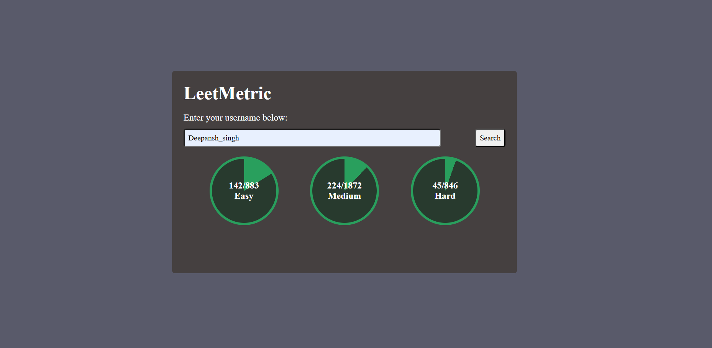

# LeetMetric

LeetMetric is a lightweight web app that lets you check a LeetCode user's problem-solving stats—broken down by Easy, Medium, and Hard difficulty levels.

## 🔍 Features

- 📊 Visual progress circles for Easy / Medium / Hard problems
- 🧑 User input to search for any LeetCode username
- ⚡ Real-time data fetched from [LeetCode Stats API](https://leetcode-stats-api.herokuapp.com/)
- 💡 Clean and responsive UI with HTML, CSS, and JavaScript

## 📸 Preview
<h3>Script1 Screenshot</h3>

screenshots/scrpit1_image.png

## 🛠 Tech Stack

- HTML5
- CSS3
- JavaScript (Vanilla)
- LeetCode Stats API

## 📂 Project Structure

```bash
├── index.html         # Main HTML file
├── style.css          # Stylesheet
├── script.js          # JavaScript to handle logic and API calls
└── README.md          # Project overview
